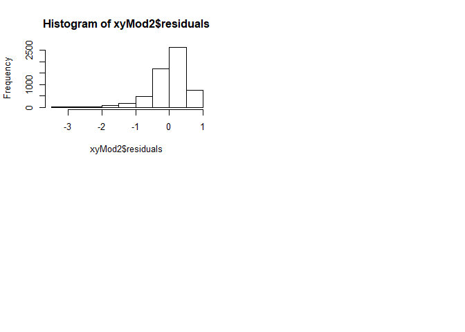

Group Project
================
Katherine Li

 

``` r
library(tidyverse)
library(dplyr)
library(ggplot2)
library(fitdistrplus)
play_orig <- read.csv("~/FALL2019/Mod 1/ITAO60200-IntroBA/Group Project/playStore5.csv")
play <- play_orig
str(play)
```

    ## 'data.frame':    8890 obs. of  13 variables:
    ##  $ App           : Factor w/ 8044 levels "\"i DT\" Fútbol. Todos Somos Técnicos.",..: 3029 6775 4771 1759 2196 2014 540 1715 5723 2393 ...
    ##  $ Category      : Factor w/ 34 levels "1.9","ART_AND_DESIGN",..: 2 32 8 17 6 31 8 22 13 16 ...
    ##  $ Rating        : num  NA 4.5 4.3 5 4.5 5 4.4 4.2 4.8 NA ...
    ##  $ Reviews       : Factor w/ 5062 levels "0","1","10","100",..: 4281 3439 2025 2 3789 2806 2347 1384 2152 1 ...
    ##  $ Size          : Factor w/ 428 levels "1,000+","1.0M",..: 207 112 428 296 428 115 45 70 256 428 ...
    ##  $ Installs      : Factor w/ 22 levels "0","0+","1,000,000,000+",..: 14 7 10 9 5 12 11 5 7 6 ...
    ##  $ Type          : Factor w/ 4 levels "0","Free","NaN",..: 2 2 2 2 2 2 2 2 2 4 ...
    ##  $ Price         : Factor w/ 79 levels "$0.99 ","$1.00 ",..: 78 78 78 78 78 78 78 78 78 1 ...
    ##  $ Content.Rating: Factor w/ 7 levels "","Adults only 18+",..: 3 3 3 3 3 6 3 4 3 3 ...
    ##  $ Genres        : Factor w/ 118 levels "11-Feb-18","Action",..: 11 110 37 63 23 109 37 72 55 8 ...
    ##  $ Last.Updated  : Factor w/ 1292 levels "1-Apr-16","1-Apr-17",..: 1006 1134 939 1270 1112 478 322 597 939 705 ...
    ##  $ Current.Ver   : Factor w/ 2466 levels "","0.0.0.2","0.0.1",..: 97 2008 2461 1745 2135 97 944 682 2461 2461 ...
    ##  $ Android.Ver   : Factor w/ 35 levels "","1.0 and up",..: 10 22 35 19 15 15 19 19 35 35 ...

 

 

## Data Cleaning

``` r
play <- play %>% 
  # remove the duplicates and keep the only line with the highest number of reviews
  # first, show the results in a decreasing order for reviews
  arrange(desc(Reviews)) %>% 
  
  # use distinct function to remove duplicate 
  # set keep_all to true to show all columns
  distinct(App,.keep_all = TRUE) %>% 
  
  # change it into the appropriate data type
  mutate(Rating = as.numeric(as.character(Rating)),
         Reviews = as.numeric(as.character(Reviews))) %>%
  
  # since we set ratings as dependent variable, we need to filter out the meaningless data with a NA rating
  # filter out those with non-numeric size
  # we find out that one line data is placed into the wrong column and need to filter it out
  # in the installs column, it has the 'free' character which should be in the Type column
  filter(Rating != "NA" & Reviews != 0 & Size != "Varies with device" & Installs != "Free") %>%
  
  # transform and group the 'installs' column 
  # remove the coma using str_replace_all function
  mutate(Installs = str_replace_all(Installs, ",", ""))

# remove the plus sign using gsub function
play$Installs <- gsub("\\+", "", play$Installs)
# change into appropriate data type
play$Installs = as.numeric(as.character(play$Installs))

# regroup the Installs into 6 categories which have equal proportion 
play$Installs[play$Installs == 1 | play$Installs == 5 | play$Installs == 10 | play$Installs == 50 | play$Installs == 100 | play$Installs == 500] <- "XXS"
play$Installs[play$Installs == 1000 | play$Installs == 5000] <- "XS"
play$Installs[play$Installs == 10000 | play$Installs == 50000] <- "S"
play$Installs[play$Installs == 100000 | play$Installs == 500000] <- "M"
play$Installs[play$Installs == 1000000] <- "L"
play$Installs[play$Installs == 5000000 | play$Installs == 10000000 | play$Installs == 50000000 | play$Installs == 100000000 | play$Installs == 500000000 | play$Installs == 1000000000] <- "XL"

play$Installs <- as.factor(play$Installs)

# remove the dollar sign in Price column
play$Price <- gsub("\\$", "", play$Price)
# change into appropriate data type
play$Price = as.numeric(as.character(play$Price))

# handle the Size column
# separate the Size into two column of the size number and unit(KB/MB)
play <- play %>% 
  # because the format is the same as xxM / xxK, so separate from the first in the right hand 
  separate(Size, c("size_num", "size_unit"), -1) 
play$size_num <- as.numeric(as.character(play$size_num))
# we use ifelse function to transform KB to MB
play$size_num <- ifelse(play$size_unit == "k",
                        round(play$size_num/1024),
                        play$size_num)
# delete the unit column
play <- play[,-6]

# double check the structure of dataset
str(play)
```

    ## 'data.frame':    5814 obs. of  13 variables:
    ##  $ App           : Factor w/ 8044 levels "\"i DT\" Fútbol. Todos Somos Técnicos.",..: 4175 6831 7553 2836 1444 3035 400 1501 7133 1031 ...
    ##  $ Category      : Factor w/ 34 levels "1.9","ART_AND_DESIGN",..: 30 28 30 32 33 31 13 7 22 3 ...
    ##  $ Rating        : num  4.2 4.2 4 4.7 4.3 4.3 4.6 4.5 4.7 4.5 ...
    ##  $ Reviews       : num  9992 9975 9971 9971 9966 ...
    ##  $ size_num      : num  31 18 33 22 5.5 10 3.7 38 97 2.9 ...
    ##  $ Installs      : Factor w/ 6 levels "L","M","S","XL",..: 1 1 1 2 1 3 2 2 2 2 ...
    ##  $ Type          : Factor w/ 4 levels "0","Free","NaN",..: 2 2 2 2 2 2 2 2 2 2 ...
    ##  $ Price         : num  0 0 0 0 0 0 0 0 0 0 ...
    ##  $ Content.Rating: Factor w/ 7 levels "","Adults only 18+",..: 3 3 3 6 3 3 6 4 3 3 ...
    ##  $ Genres        : Factor w/ 118 levels "11-Feb-18","Action",..: 103 97 103 110 114 109 53 35 72 15 ...
    ##  $ Last.Updated  : Factor w/ 1292 levels "1-Apr-16","1-Apr-17",..: 678 617 1108 1134 1035 899 1101 1033 1103 849 ...
    ##  $ Current.Ver   : Factor w/ 2466 levels "","0.0.0.2","0.0.1",..: 2140 516 2192 451 426 1093 104 1762 1930 600 ...
    ##  $ Android.Ver   : Factor w/ 35 levels "","1.0 and up",..: 19 21 27 27 7 17 17 19 19 19 ...

 

 

## Goal

We are trying to generate a predictive model for application developers
to understand what factors will impact the overall rating of the
application, and maybe make certain adjustments to their products. We
picked rating as the dependent variable and by using some T-Test, Anova
Test and linear regression model, we tested some of the possible
independent variables which would affect the prediction of rating.

 

## T-TEST Ratomg \~ Type

For variables with two groups, we could use t-test to tell the mean
difference between groups. As we want to test if there is a difference
in rating between paid and free applications, we run a t test on
‘type’, which would tell the mean difference of rating for paid
and free applications.

 

Hypothesis:

H0: There is no difference between free and paid applications on rating.

H1: There is a difference between free and paid applications on rating.

``` r
t.test(play$Rating ~ play$Type, alternative = "two.side")
```

    ## 
    ##  Welch Two Sample t-test
    ## 
    ## data:  play$Rating by play$Type
    ## t = -2.7924, df = 525.05, p-value = 0.005422
    ## alternative hypothesis: true difference in means is not equal to 0
    ## 95 percent confidence interval:
    ##  -0.13454089 -0.02341706
    ## sample estimates:
    ## mean in group Free mean in group Paid 
    ##           4.159347           4.238326

``` r
hist(play$Rating)
```

<!-- -->
 

Interpretation:

The absolute value of the t score (-2.7924) is greater than 1.96, which
is sufficiently large because only if the coefficient is much larger
than its standard error then t-value would be significant. We also have
a significant p-value of 0.005422 greater than 0.05. This indicates that
we can reject the null hypothesis and draw a conclusion that there is a
difference between the free and paid applications on rating. Also, we
can see the mean difference between groups through the sample estimates
section.

Limitation:

Something needs to be noticed is that even though we reject the null
hypothesis, but it is up to 50% chance of incorrectly rejecting the null
for the population with p-value of 0.05 and up to 15% chance for a
p-value of 0.01. Another limitation includes the dependent variable is
not normally distributed based on the histogram.

 

 

## ANOVA 1 Rating \~ Installs

We want to see if there is a difference in ratings among different
levels of installations. The installations are listed as “0”,
“0+”, “1+”, “5+”, “10+”, “50+”, and continued
in identical format till “1,000,000,000+”. There is also one input
marked “free”. We first run a summary on the variable “installs”
from the original dataset to see the detailed distribution of data
across different levels of installations. To prepare the data for
efficiency purposes, we aim to group all the installation levels into
six groups with nearly equal proportion of data included. We group
“0”, “0+”, “1+”, “5+”, “10+”, “50+”,
“100+”, and “500+” as the first group which contains 979 data
points, and assign “XXS” to data points associated. Group 2 includes
“1,000+” and “5,000+” - 1078 data points in total, which are
marked as “XS”. Group 3 takes in “10,000+” and “50,000+” -
1187 data points, which are marked as “S”. With this method applied
further, we have group 4 labeled as “M” with 1198 data points, group
5 labeled as “L” with 971 data points, and group 6 labeled as
“XL” with 1108 data points. As for the single “free” one,
we drop the record since it would barely affect the final result.

After this data cleaning process, we run an ANOVA test to verify our
hypothesis:

H0: There is no significant difference in ratings across the six groups
with different levels of installations.

Ha: There exists some significant differences in ratings across the six
groups with different levels of installations.

``` r
summary(play_orig$Installs)
```

    ##              0             0+ 1,000,000,000+     1,000,000+         1,000+ 
    ##              1             13             50           1280            746 
    ##             1+    10,000,000+        10,000+            10+   100,000,000+ 
    ##             55           1040            885            318            328 
    ##       100,000+           100+     5,000,000+         5,000+             5+ 
    ##            948            591            606            399             71 
    ##    50,000,000+        50,000+            50+   500,000,000+       500,000+ 
    ##            230            390            168             58            442 
    ##           500+           Free 
    ##            270              1

``` r
installsModel = aov(Rating ~ Installs, data = play)
summary(installsModel)
```

    ##               Df Sum Sq Mean Sq F value Pr(>F)    
    ## Installs       5   72.3  14.450    48.7 <2e-16 ***
    ## Residuals   5808 1723.2   0.297                   
    ## ---
    ## Signif. codes:  0 '***' 0.001 '**' 0.01 '*' 0.05 '.' 0.1 ' ' 1

``` r
TukeyHSD(installsModel)
```

    ##   Tukey multiple comparisons of means
    ##     95% family-wise confidence level
    ## 
    ## Fit: aov(formula = Rating ~ Installs, data = play)
    ## 
    ## $Installs
    ##                diff         lwr         upr     p adj
    ## M-L    -0.090626714 -0.15782095 -0.02343248 0.0016990
    ## S-L    -0.180539881 -0.24836699 -0.11271277 0.0000000
    ## XL-L    0.070111839  0.00183594  0.13838774 0.0401466
    ## XS-L   -0.180665996 -0.25271847 -0.10861353 0.0000000
    ## XXS-L   0.133850326  0.04929816  0.21840249 0.0000953
    ## S-M    -0.089913167 -0.15429024 -0.02553609 0.0009791
    ## XL-M    0.160738553  0.09588881  0.22558829 0.0000000
    ## XS-M   -0.090039282 -0.15885388 -0.02122468 0.0026588
    ## XXS-M   0.224477040  0.14266653  0.30628755 0.0000000
    ## XL-S    0.250651720  0.18514645  0.31615699 0.0000000
    ## XS-S   -0.000126115 -0.06955882  0.06930659 1.0000000
    ## XXS-S   0.314390207  0.23205910  0.39672131 0.0000000
    ## XS-XL  -0.250777835 -0.32064901 -0.18090666 0.0000000
    ## XXS-XL  0.063738487 -0.01896274  0.14643971 0.2391539
    ## XXS-XS  0.314516322  0.22867081  0.40036184 0.0000000

 

Interpretation:

The resulting p-value appears really small, which implies that there
exists a significant difference of ratings in at least one comparison
pair between two groups of installation levels. We could reject the null
hypothesis.

To find out exactly which comparison pairs showcase this significance
difference. We then run a Tukey’s HSD test. We could see that the
p-values for 13 out of 15 comparison pairs have small p-values. The
p-values for pairs XXS-XL, and XS-S are large. Plus, the p-value for
pair L-XL is quite close to the 0.05 cut-off. If we set our cut-off
point to 0.01, this p-value will also be considered as large. In regard
to the reason why differences between pair XXS-XL is not significant, it
might be due to the nature of how ratings are generated. To elaborate,
when apps have fewer installations, then fewer people would rate them,
and thus the ratings are determined only by relatively smaller pools of
people. When apps have more installations, then more people would rate
them, and therefore the extreme values of ratings could more easily be
evened out. In terms of the non-significant difference between pair
XS-S, we need more information in order to explain this situation.

 

``` r
hist(residuals(installsModel))
```

<!-- -->
 

Limitation:

There are definitely limitations within our tests. One might be related
to our approach of grouping different levels of installs into smaller
groups. Though we have tried to have smaller groups that contain
proportions of data that are as equivalent as possible, the amounts of
data points included in each group still vary within a considerably
large range. For instance, group “L” has 971 data points while group
“M” has 1198 data points. This might affect our result to a certain
extent.

Moreover, the residuals does not appear to be normally distributed -
this opposes certain assumptions that ANOVA test is based on.

 

 

## Regression Model

After we get the result from T test and ANOVA, we decided to use Price,
Number of reviews, Number of Installs and Paid Type to predict Rating.

Hypothesis \#1:

H0: Price does not have an impact on Ratings

H1: Price has a negative impact on Ratings

Hypothesis \#2:

H0: Number of installs does not have an impact on Ratings

H1: Number of installs has a positive impact on Ratings

Hypothesis \#3:

H0: Size does not have an impact on Ratings

H1: Size has a positive impact on Ratings

Hypothesis \#4:

H0: Payment type of application does not have an impact on Ratings

H1: Paid application has an impact on Ratings

Hypothesis \#5:

H0: Reviews does not have an impact on Ratings

H1: Reviews has a negative impact on Ratings

 

Before we started, we build two graphs to find if there is any
correlation between the variables.

``` r
pairs(play[,4:8])
```

<!-- -->
 

 

    ## 
    ## Attaching package: 'reshape2'

    ## The following object is masked from 'package:tidyr':
    ## 
    ##     smiths

    ##       Var1    Var2  value
    ## 1  reviews reviews  1.000
    ## 2     size reviews  0.220
    ## 3 installs reviews  0.080
    ## 4     type reviews  0.002
    ## 5    price reviews -0.010
    ## 6  reviews    size  0.220

<!-- -->
 

``` r
boxplot(Rating ~ Installs, data = play)
```

<!-- -->

``` r
boxplot(Rating ~ Type, data = play)
```

<!-- -->
 

Interpretation:

By comparing the result from the box plot, we choose the category XL and
category Free as our reference. Because the values within the category
is more clustered than other categories and the difference is more
obvious.

 

``` r
play$Installs <- relevel(play$Installs, ref='XL')
xyMod2 = lm(Rating ~ Price  + Installs + Type + size_num + Reviews, data = play)
summary(xyMod2)
```

    ## 
    ## Call:
    ## lm(formula = Rating ~ Price + Installs + Type + size_num + Reviews, 
    ##     data = play)
    ## 
    ## Residuals:
    ##     Min      1Q  Median      3Q     Max 
    ## -3.4577 -0.2153  0.0819  0.3535  0.9851 
    ## 
    ## Coefficients:
    ##               Estimate Std. Error t value Pr(>|t|)    
    ## (Intercept)  4.261e+00  2.010e-02 211.980  < 2e-16 ***
    ## Price       -7.743e-04  3.671e-04  -2.109  0.03499 *  
    ## InstallsL   -5.421e-02  2.448e-02  -2.214  0.02685 *  
    ## InstallsM   -1.458e-01  2.358e-02  -6.185 6.62e-10 ***
    ## InstallsS   -2.383e-01  2.421e-02  -9.843  < 2e-16 ***
    ## InstallsXS  -2.468e-01  2.617e-02  -9.430  < 2e-16 ***
    ## InstallsXXS  6.115e-02  3.067e-02   1.994  0.04620 *  
    ## TypePaid     1.303e-01  2.839e-02   4.589 4.55e-06 ***
    ## size_num     4.731e-04  3.333e-04   1.419  0.15592    
    ## Reviews      1.917e-08  6.775e-09   2.830  0.00467 ** 
    ## ---
    ## Signif. codes:  0 '***' 0.001 '**' 0.01 '*' 0.05 '.' 0.1 ' ' 1
    ## 
    ## Residual standard error: 0.5433 on 5804 degrees of freedom
    ## Multiple R-squared:  0.0459, Adjusted R-squared:  0.04442 
    ## F-statistic: 31.03 on 9 and 5804 DF,  p-value: < 2.2e-16

 

Interpretation:

Our intercept has a value of 4.2. This would indicate that application
with 0 in price, size, reviews and type:free and installs:L will have a
score of 4.2 in rating.

The coefficient for price is -0.0008 and for size is -0.0005 which said
that for each unit increase in price and size, the rating will decrease
by 0.0008 and by 0.0005 respectively. The coefficient of reviews is
1.3\*10^-8 and for each unit increase the rating will increase by that
number. For installs size in category XXS, 0.1 tell us the change in the
mean rating for someone who is in XXS relative to category XL. The
category XS’s coefficient of -0.19 tell us the expected change for
mean rating for someone who is in XS relative to category XL. The
category S,M and L’s coefficient act the same.

The p value of price and reviews is less than 0.05 so we can reject H0
in Hypothesis 1 and Hypothesis 5. The p value of the size is larger than
0.05 so we fail to reject H0 in Hypothesis 3: Size does not have an
impact on Ratings. The t value and p value of the type and installs
variables are all significant because their p-value is less than 0.05.
So we can reject the H0 of the Hypothesis 2 and hypothesis 4.

The F-statistic for the whole model is 34 and that means difference in
variance is significant because the corresponding p-value is less than
0.05. The “Residuals vs Fitted” plot and the “Scale-Location”
plot are showing us our linear relationships within residuals and it
looks a bit weird because we have categorical variables in our model but
the overall fitness is fine.Finally, “Residuals vs Leverage” shows
us observations exhibiting a high degree of leverage on our regression.

 

``` r
par(mfrow = c(2, 2))
plot(xyMod2)
```

<!-- -->

``` r
hist(xyMod2$residuals)
```

<!-- -->
 

Limitation:

The regression model needs to be further improved for better fit because
it has the ability to predict but we can’t say that this is the best
predictive model. The “Normal Q-Q” plot is saying that our errors
are not normally-distributed so I draw a histogram to see the
distribution directly.

The adjusted R-square is really close to 0 but the r-square is based on
a context and can be improved so we can’t say for sure that the model
is useless. The independent variables such as price have some outliers
that may impact the fitness of regression greatly.

 

 

## ANOVA 2 Rating \~ Content.Rating

We are also curious about if there is any significant difference in
ratings across groups of apps that are associated with different content
ratings. In the original dataset there are one record with content
rating left blank - this got cleaned out during our previous data
preparation. Running summary on the sorted dataset, we detect there is
only one record with content rating marked “unrated” - we decide to
filter out this record for our following ANOVA test. Now we have content
ratings categorized into five groups, which are “Adults only 18+”,
“Everyone”, “Everyone 10+”, “Mature 17+” and “Teen”.

We run an ANOVA test for our hypothesis:

H0: There does not exist any significant difference in ratings among
groups with different content ratings.

Ha: There are significant differences in ratings among the five groups
with different content ratings.

``` r
summary (play_orig$Content.Rating)
```

    ##                 Adults only 18+        Everyone    Everyone 10+ 
    ##               1               1            7152             344 
    ##      Mature 17+            Teen         Unrated 
    ##             427             964               1

``` r
summary (play$Content.Rating)
```

    ##                 Adults only 18+        Everyone    Everyone 10+ 
    ##               0               1            4706             221 
    ##      Mature 17+            Teen         Unrated 
    ##             265             620               1

``` r
play3 <- play %>%
  filter(Content.Rating != "Unrated")
contentModel = aov(Rating ~ Content.Rating, data = play3)
summary(contentModel)
```

    ##                  Df Sum Sq Mean Sq F value   Pr(>F)    
    ## Content.Rating    4    6.5   1.636   5.313 0.000287 ***
    ## Residuals      5808 1788.9   0.308                     
    ## ---
    ## Signif. codes:  0 '***' 0.001 '**' 0.01 '*' 0.05 '.' 0.1 ' ' 1

``` r
TukeyHSD(contentModel)
```

    ##   Tukey multiple comparisons of means
    ##     95% family-wise confidence level
    ## 
    ## Fit: aov(formula = Rating ~ Content.Rating, data = play3)
    ## 
    ## $Content.Rating
    ##                                     diff         lwr         upr     p adj
    ## Everyone-Adults only 18+     -0.34392265 -1.85843051  1.17058521 0.9720035
    ## Everyone 10+-Adults only 18+ -0.25384615 -1.77161538  1.26392308 0.9910740
    ## Mature 17+-Adults only 18+   -0.40490566 -1.92210720  1.11229588 0.9500072
    ## Teen-Adults only 18+         -0.26193548 -1.77750321  1.25363224 0.9898876
    ## Everyone 10+-Everyone         0.09007650 -0.01415394  0.19430694 0.1271422
    ## Mature 17+-Everyone          -0.06098301 -0.15659192  0.03462590 0.4091184
    ## Teen-Everyone                 0.08198717  0.01728718  0.14668715 0.0049780
    ## Mature 17+-Everyone 10+      -0.15105951 -0.28901038 -0.01310863 0.0235957
    ## Teen-Everyone 10+            -0.00808933 -0.12672940  0.11055074 0.9997328
    ## Teen-Mature 17+               0.14297018  0.03182817  0.25411219 0.0041228

 

Interpretation:

The p-value from ANOVA is small - sufficient for us to reject the null.
We could conclude that there exist certain significant differences in
ratings among the five groups with different content ratings. To explore
about exactly which comparison pairs showcase the significant
difference, we run a Tukey HSD test.

From the results of the Tukey test, we could clearly see that only the
p-values for pair Teen-Everyone, Teen-Mature 17+, and Mature 17+ -
Everyone 10+ are small enough to imply the significance of differences.
This is based on the scenario if we set the cut-off point for p-value to
0.05. If we set the cut-off point to 0.01, the difference of average
rating between the two groups in the last pair would not be considered
as significant. One implication from this result could be that the main
users of teen apps are teens. And most likely, whoever rate those apps
are teens as well. Teens might not be as critical as older people when
it comes to rating an app. They might not have that many expectations or
requests as older people normally do. So the average rating for teen
apps would be higher than the average ratings for both Mature 17+ and
Everyone apps. This could also be supported by the fact that p-value for
Teen-Mature 17+ is 0.0041228, which is slightly smaller than the p-value
for Teen-Everyone. Since a majority of the users rating the Mature 17+
apps would be people over 17, it is quite reasonable that the
differences between the former pair would be moderately more
significant.

Limitation:

However, if we look at the results for pairs Teen-Adults only 18+, and
Teen-Everyone+, we could hardly detect similar patterns as what we just
discussed. This suggests that we need to investigate more on the reasons
why there are significant differences in ratings between the two
aforementioned pairs, Teen-Mature 17+ and Teen-Everyone 10+. As for the
pair Mature 17+ - Everyone 10+, we also need more information in order
to thoroughly understand the result. These imply the complexity of the
reasons why ratings differentiate among certain groups with different
content ratings. These also hint on the limitations of the original data
set when we try to delve deeper into the issue.

 

 

## ANOVA 3 Rating \~ Category

We want to test if there is a difference in average rating among
different categories so we first run a anova test for the category.
There are 33 levels of category and the resulting p-value is small,
which means that there is a significant difference in at least one of
the category comparisons. We then run a Tukey test and found that most
of the comparisons among two categories have big p-adjusted, meaning
that the differences are insignificant.

In real life, in order to make informational decisions, people usually
start from the highest level and then go into details for more
exploration. And since we already identified that there is at least one
significant difference across categories, we want to know that from a
higher level, the rating of which broader group is most distinct from
all others. Based on our understanding of the apps and personal
experiences, we manually created four broader groups: Entertainment,
Education, Tool, and Living. We then conducted a ANOVA and Tukey test to
test our hypothesis.

 

Hypothesis:

H0: the average rating is the same across all four groups

Ha: the average rating is not the same across all four groups

``` r
play2 <- play

play2$Category = as.character(play2$Category)

play2$Category[play2$Category == "ART_AND_DESIGN" | play2$Category == "SPORTS" | play2$Category == "COMICS" | play2$Category == "ENTERTAINMENT" | play2$Category == "GAME" | play2$Category == "SPORTS" | play2$Category == "SHOPPING" | play2$Category == "TRAVEL_AND_LOCAL" | play2$Category == "VIDEO_PLAYERS" | play2$Category == "SOCIAL" | play2$Category == "PHOTOGRAPHY" | play2$Category == "PERSONALIZATION" | play2$Category == "DATING" | play2$Category == "BEAUTY" | play2$Category == "AUTO_AND_VEHICLES"] <- "ENTERTAINMENT"

play2$Category[play2$Category == "BOOKS_AND_REFERENCE" | play2$Category == "NEWS_AND_MAGAZINES" | play2$Category == "EDUCATION" | play2$Category == "BUSINESS" | play2$Category == "PRODUCTIVITY" | play2$Category == "FINANCE" | play2$Category == "LIBRARIES_AND_DEMO"] <- "EDUCATION"

play2$Category[play2$Category == "TOOLS" | play2$Category == "MAPS_AND_NAVIGATION" | play2$Category == "COMMUNICATION"] <-  "TOOL"

play2$Category[play2$Category == "HOUSE_AND_HOME" | play2$Category == "PARENTING" | play2$Category == "MEDICAL" | play2$Category == "FAMILY" | play2$Category == "LIFESTYLE" | play2$Category == "WEATHER" | play2$Category == "EVENTS" | play2$Category == "FOOD_AND_DRINK" | play2$Category == "HEALTH_AND_FITNESS"] <-  "LIVING"
```

 

``` r
categoryModel = aov(Rating ~ Category, data = play2)
summary(categoryModel)
```

    ##               Df Sum Sq Mean Sq F value   Pr(>F)    
    ## Category       3   18.1   6.042   19.75 9.84e-13 ***
    ## Residuals   5810 1777.3   0.306                     
    ## ---
    ## Signif. codes:  0 '***' 0.001 '**' 0.01 '*' 0.05 '.' 0.1 ' ' 1

``` r
TukeyHSD(categoryModel)
```

    ##   Tukey multiple comparisons of means
    ##     95% family-wise confidence level
    ## 
    ## Fit: aov(formula = Rating ~ Category, data = play2)
    ## 
    ## $Category
    ##                                 diff         lwr         upr     p adj
    ## ENTERTAINMENT-EDUCATION  0.029941843 -0.02591335  0.08579703 0.5135141
    ## LIVING-EDUCATION         0.020241221 -0.03550831  0.07599075 0.7871030
    ## TOOL-EDUCATION          -0.145377981 -0.21541398 -0.07534198 0.0000006
    ## LIVING-ENTERTAINMENT    -0.009700622 -0.05388629  0.03448505 0.9426671
    ## TOOL-ENTERTAINMENT      -0.175319823 -0.23655221 -0.11408744 0.0000000
    ## TOOL-LIVING             -0.165619202 -0.22675522 -0.10448319 0.0000000

 

Interpretation:

Based on our results, we identified that TOOL category overall has the
most significant difference from the other three categories and its apps
have the lowest average rating. We believe that one of the reasons for
this pattern is that tools (which includes communication and maps &
navigation) are the most commonly used apps on a daily basis so people
generally will be more critical and have higher expectations on the
functionality of these apps.

 

``` r
hist(residuals(categoryModel))
```

<!-- -->

``` r
library(car)
leveneTest(Rating ~ Category, data = play)
```

    ## Levene's Test for Homogeneity of Variance (center = median)
    ##         Df F value    Pr(>F)    
    ## group   32  6.3461 < 2.2e-16 ***
    ##       5781                      
    ## ---
    ## Signif. codes:  0 '***' 0.001 '**' 0.01 '*' 0.05 '.' 0.1 ' ' 1

Limitation:

Our classification of the categories is highly biased and different
methods of classification might lead to different results.

Additionally, there are multiple assumptions on One-Way Anova test:
errors are independent, errors are normally distributed, variances are
homogeneous, and additivity of model effects. We ran some examinations
to test the second and third assumptions. From the residual histogram,
we can see that the residuals are not normally distributed and the
distribution is skewed to the left, which means that the normality
assumption in this analysis is not met. Furthermore, the p-value
resulted from the Levene’s Test is significant. Thus the null hypothesis
is rejected and we concluded that the variances are not homogeneous. The
failure to meet the assumptions of Anova test is one of the limitations
for this analysis.
